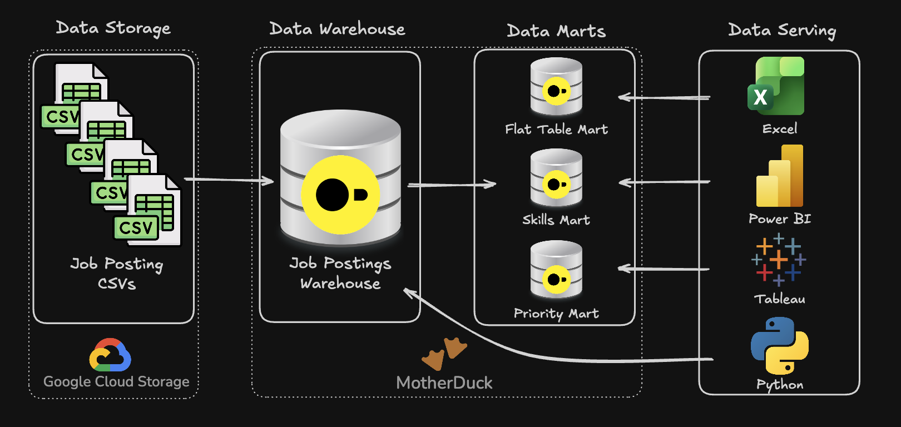
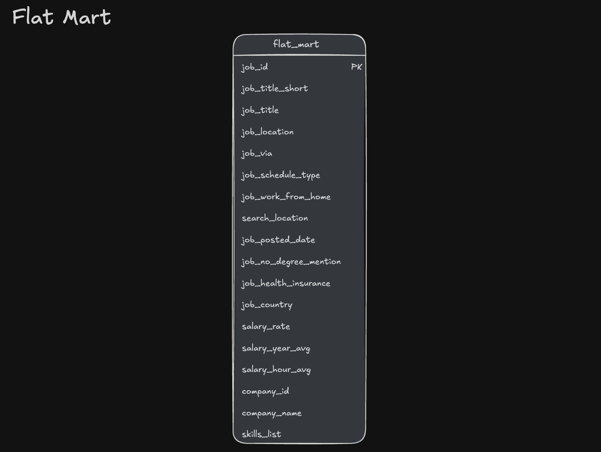
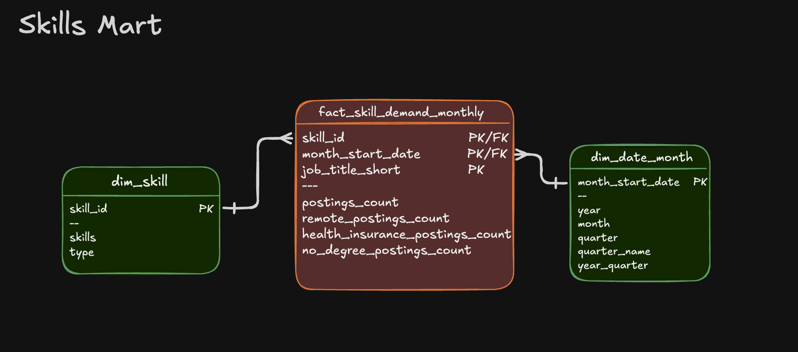
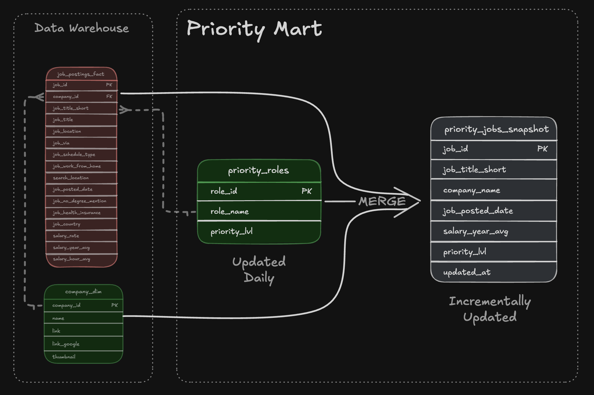

# 🏗️ Data Warehouse & Mart Build: Production ETL Pipeline

An end-to-end data engineering pipeline that transforms raw CSV files from Google Cloud Storage into a normalized star schema data warehouse, then builds analytical data marts.



---

## 🧾 Executive Summary (For Hiring Managers)

- ✅ **Pipeline scope:** Built a complete **ETL pipeline** from raw CSVs to star schema warehouse to analytical marts  
- ✅ **Data modeling:** Designed a **star schema** with fact tables, dimensions, and bridge tables for many-to-many relationships  
- ✅ **ETL development:** Implemented **extract, transform, load** processes with idempotent operations and data quality checks  
- ✅ **Mart architecture:** Created **specialized data marts** (flat, skills, priority) with additive measures and incremental update patterns

---

## 🧩 Problem & Context

Raw job posting data arrives as flat CSV files in Google Cloud Storage—not structured for analytical queries. Analysts need to answer:

- Which skills are most in-demand over time?
- What are hiring trends by company and location?
- How do salary patterns vary by role and skill?

**Challenge:** Data teams need a single source of truth system—a data warehouse—to enable consistent, reliable analysis across the organization. Additionally, specialized data marts are required to optimize resources by pre-aggregating data for specific business use cases, reducing query complexity and improving performance for common analytical patterns.

**Solution:** End-to-end ETL pipeline that extracts CSVs from cloud storage, normalizes them into a star schema warehouse (separating facts from dimensions), and creates specialized data marts optimized for specific use cases (flat queries, skill demand analysis, priority role tracking).  

---

## 🧰 Tech Stack

- 🐤 **Database:** DuckDB (file-based OLAP database with GCS integration via `httpfs`)  
- 🧮 **Language:** SQL (DDL for schema design, DML for data loading and transformation)  
- 📊 **Data Model:** Star schema (fact + dimension + bridge tables)  
- 🛠️ **Development:** VS Code for SQL editing + Terminal for DuckDB CLI execution  
- 🔧 **Automation:** Master SQL script for pipeline orchestration  
- 📦 **Version Control:** Git/GitHub for versioned pipeline scripts  
- ☁️ **Storage:** Google Cloud Storage for source CSV files  

---

## 📂 Repository Structure

```text
2_WH_Mart_Build/
├── 01_create_tables_dw.sql        # Star schema DDL
├── 02_load_schema_dw.sql          # GCS data extraction & loading
├── 03_create_flat_mart.sql        # Denormalized flat mart
├── 04_create_skills_mart.sql      # Skills demand mart
├── 05_create_priority_mart.sql    # Priority roles mart
├── 06_update_priority_mart.sql    # Priority mart incremental update (MERGE)
├── 07_create_company_mart.sql     # Company hiring mart (optional)
├── build_dw_marts.sql             # Master SQL build script
└── README.md                       # You are here
```

---

## 🏗️ Pipeline Architecture


The pipeline transforms job posting CSVs from Google Cloud Storage into a normalized star schema data warehouse, then builds specialized analytical data marts. BI tools (Excel, Power BI, Tableau, Python) consume from both the warehouse and marts.

### Data Warehouse

The data warehouse implements a star schema with `company_dim`, `skills_dim`, `job_postings_fact`, and `skills_job_dim` tables.


- **SQL Files:**
  - [`01_create_tables_dw.sql`](./01_create_tables_dw.sql) – Defines star schema with 4 core tables
  - [`02_load_schema_dw.sql`](./02_load_schema_dw.sql) – Extracts CSVs from GCS and loads into warehouse tables
- **Purpose:** Star schema serving as single source of truth for analytical queries
- **Grain:** One row per job posting in the fact table (`job_postings_fact`)

### Flat Mart

Denormalized table with all dimensions for ad-hoc queries.



- **SQL File:** [`03_create_flat_mart.sql`](./03_create_flat_mart.sql) – Builds denormalized table with all dimensions joined
- **Purpose:** Denormalized table for quick ad-hoc queries
- **Grain:** One row per job posting with all dimensions joined

### Skills Mart

Time-series skill demand analysis with additive measures.



- **SQL File:** [`04_create_skills_mart.sql`](./04_create_skills_mart.sql) – Builds time-series skill demand mart
- **Purpose:** Time-series analysis of skill demand over time with additive measures
- **Grain:** `skill_id + month_start_date + job_title_short`
- **Key Features:** All measures are additive (counts/sums) for safe re-aggregation

### Priority Mart

Priority role tracking with incremental updates using MERGE operations.



- **SQL Files:**
  - [`05_create_priority_mart.sql`](./05_create_priority_mart.sql) – Initial build of priority roles and jobs snapshot
  - [`06_update_priority_mart.sql`](./06_update_priority_mart.sql) – **Incremental update using MERGE** (upsert pattern)
- **Purpose:** Track priority roles and job snapshots with incremental update capabilities
- **Grain:** One row per job posting with priority level assignment
- **Key Features:** **MERGE operations for incremental updates** - demonstrates production-ready upsert patterns (INSERT, UPDATE, DELETE in single statement)

### Company Mart (Optional)

Company hiring trends by role, location, and month.


- **SQL File:** [`07_create_company_mart.sql`](./07_create_company_mart.sql) – Builds company hiring trends mart (optional)
- **Purpose:** Company hiring trends analysis by role, location, and month
- **Grain:** `company_id + job_title_short_id + location_id + month_start_date`
- **Key Features:** Bridge tables for many-to-many relationships (company-location, job title hierarchies)
- **Note:** This mart is optional and can be skipped if not needed

---

## 💻 Data Engineering Skills Demonstrated

### ETL Pipeline Development

- **Extract:** Direct CSV loading from Google Cloud Storage using DuckDB's `httpfs` extension  
- **Transform:** Data normalization, type conversion (`CAST`, `DATE_TRUNC`), and quality filtering  
- **Load:** Idempotent table creation with `DROP TABLE IF EXISTS` patterns  
- **Incremental Updates:** MERGE operations for upsert patterns (INSERT, UPDATE, DELETE in single statement)  
- **Orchestration:** Master SQL script (`build_dw_marts.sql`) for automated pipeline execution  

### Dimensional Modeling

- **Star Schema Design:** Fact table (`job_postings_fact`) with dimension tables (`company_dim`, `skills_dim`)  
- **Bridge Tables:** Many-to-many relationship handling (`skills_job_dim`, `bridge_company_location`, `bridge_job_title`)  
- **Grain Definition:** Proper fact table granularity (skill+month, company+title+location+month)  
- **Additive Measures:** Counts and sums that can be safely re-aggregated at any level  
- **Surrogate Keys:** Sequential ID generation using CTEs with self-joins (optional company_mart build only)  


### SQL Advanced Techniques

- **DDL Operations:** `CREATE TABLE`, `DROP TABLE`, `CREATE SCHEMA` for schema management  
- **DML Operations:** `INSERT INTO ... SELECT` with explicit column mapping from CSV sources  
- **MERGE Operations:** Incremental updates using `MERGE INTO` with `WHEN MATCHED`, `WHEN NOT MATCHED`, and `WHEN NOT MATCHED BY SOURCE` clauses for production-ready upsert patterns  
- **CTEs:** Common Table Expressions for complex transformations and boolean flag conversions  
- **Date Functions:** `DATE_TRUNC('month')`, `EXTRACT(quarter)` for temporal dimension creation  
- **String Functions:** `STRING_AGG` for concatenation, `REPLACE` for data cleaning  
- **Boolean Logic:** `CASE WHEN` conversions for aggregating flags (remote, health insurance, no degree)  

### Data Quality & Production Practices

- **Idempotency:** All scripts safely rerunnable without side effects  
- **Data Validation:** Verification queries at each pipeline step to ensure data integrity  
- **Type Safety:** Proper data type definitions (`VARCHAR`, `INTEGER`, `DOUBLE`, `BOOLEAN`, `TIMESTAMP`)  
- **Schema Organization:** Separate schemas (`flat_mart`, `skills_mart`, `priority_mart`, `company_mart`) for logical separation  
- **Error Handling:** Structured script execution with clear error messages and progress reporting  