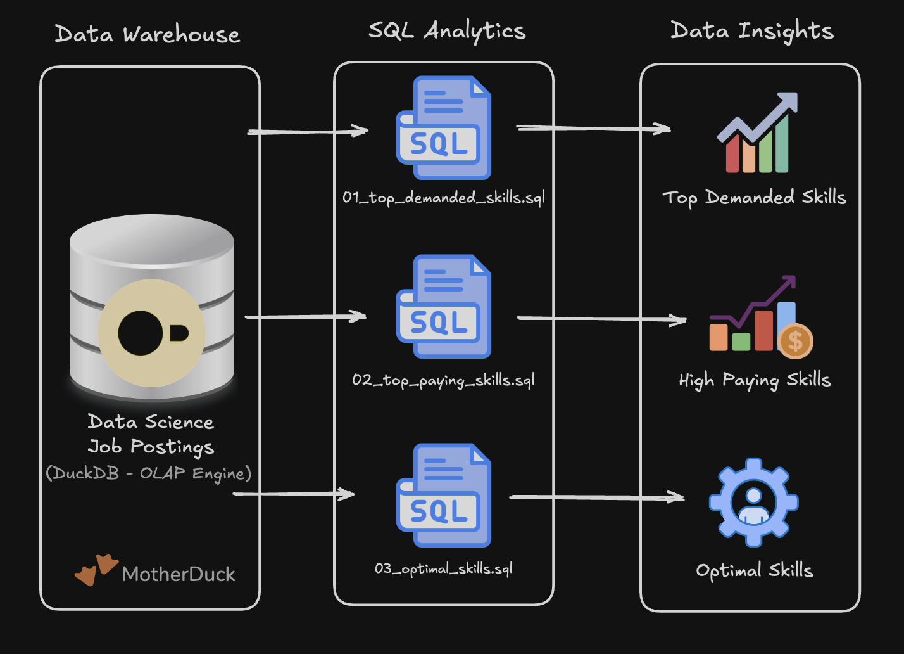

# 🛠️ SQL Data Engineering Projects

The following projects are a collection of SQL projects that I have worked on to practice and reinforce my skill w/ data engineering tools.
Hands-on projects to reinforce core data engineering concepts from the SQL for Data Engineering course.

> Click the project name below to view the tool used to build these!

## Projects

### [1. EDA](Projects/1_EDA) - Exploratory Data Analysis

SQL-driven analysis of data engineering job market trends using advanced querying techniques.

**Skills**: Complex joins, aggregations, analytical functions, data quality validation

### [2_DW_Mart_Build/](Projects/2_DW_Mart_Build/) - Data Pipeline - Data Warehouse & Mart

End-to-end ETL pipeline transforming raw CSV files into a star schema data warehouse and analytical data marts.

**Skills**: Dimensional modeling, ETL pipeline development, data mart architecture, production practices

## [3_Flat_to_WH_Build/](./3_Flat_to_WH_Build/) - Flat to Warehouse Build

*Still working on it*

SQL-driven transformation of flat job posting data into a normalized star schema using DuckDB.

**Skills**: Data transformation, star schema design, ETL pipeline development, production practices